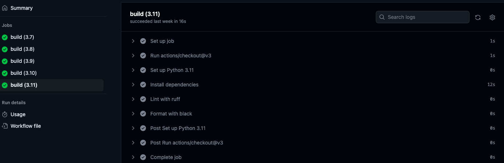

## Feature Design

This is a simple template created for python project. It contains,

* ".devcontainer" includes a Dockerfile and devcontainer.json. The 'Dockerfile' within this folder specifies how the container should be built, and other settings in this directory may control development environment configurations.

* "workflows" includes GitHub Actions, which contain configuration files for setting up automated build, test, and deployment pipelines for your project.

* ".gitignore" is used to specify which files or directories should be excluded from version control when using Git.

* "Makefile" is a configuration file used in Unix-based systems for automating tasks and building software. It contains instructions and dependencies for compiling code, running tests, and other development tasks.

* "README.md" is the instruction file for the readers.

* "app.py" is a Python file.

* "requirements.txt" is to specify the dependencies (libraries and packages) required to run the project.

I use Github Actions to run the Makefile as follows: make install, make format, make lint. You can find successful build jobs from Git Action (https://github.com/minlingz/706miniP1/actions/runs/6061466759). The workflow passed 5 version of pythons, 3.7, 3.8, 3.9, 3.10, 3.11. Each build job contains subtasks as showed below.

